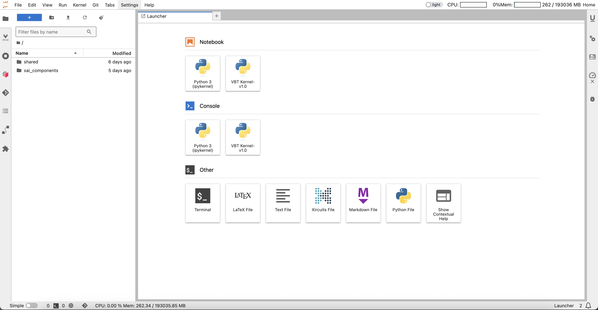
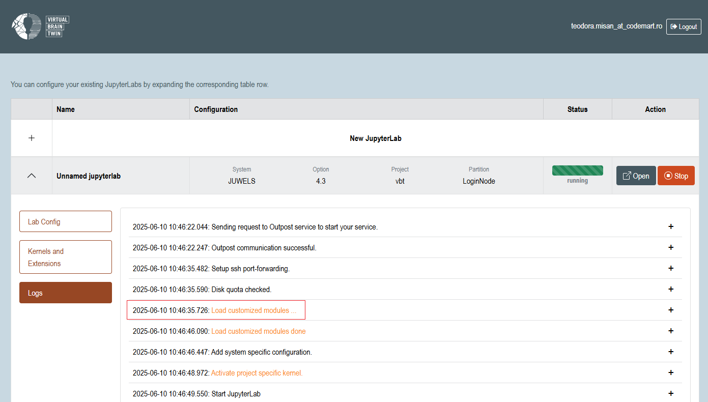

# VBT JupyterHub

The **VBT JupyterHub** is a key component of the [Virtual Brain Twin (VBT)](https://www.virtualbraintwin.eu) 
ecosystem. It is an environment fully equipped to support simulation, analysis and workflow management for your 
use-cases - whether you're running notebooks, building interactive pipelines, or submitting jobs 
to HPC resources. It features a built-in kernel pre-loaded with all essential tools and libraries 
you need to get started immediately.

**Live instance**: [https://twin.ebrains.eu](https://twin.ebrains.eu)

---

## Features

### Pre-configured VBT Kernel

The built-in **VBT Kernel (v1.0)** includes a curated set of tools and libraries to get you started immediately:

- **Simulators**:  
  `BRIAN2`, `BSB`, `NEST`, `SNUDDA`, `TVB`, and more
  
- **Extensions**:  
  `tvb-ext-unicore`, `tvb-ext-xircuits`
  
- **Python Packages**:  
  `numpy`, `numba`, `ipywidgets`, etc.

### Intended Powerful Features

- Seamless access to **JUWELS HPC** resources
- HPC job **submission and monitoring** via `tvb-ext-unicore`
- **Interactive workflows** through `tvb-ext-xircuits`
- Rich **interactive widgets** for in-notebook data exploration
- Built-in **Git integration** for version control

---

## Access

Access to the VBT JupyterHub requires a valid **JUDOOR** account.  
For account setup and login instructions, visit the [official authentication guide](https://jupyterjsc.pages.jsc.fz-juelich.de/docs/jupyterjsc/authentication).

---

## Repository Structure

This repository contains the **customized frontend** of the VBT JupyterHub. It builds upon the [JupyterHub 
Enhanced Frontend](https://github.com/jsc-jupyter/base-frontend) and is tailored specifically to support the 
needs of VBT users.

---

## Backend Requirements

The frontend is designed to operate with a dedicated backend optimized for **JupyterHub deployments** at 
the **Jülich Supercomputing Centre (JSC)**. A compatible backend setup is essential for full functionality.

---

## User Guide

The startup page features a `Sign In` button along with links to information relevant to VBT:


After signing in, you are taken to the **Home Page**, where you can access the **JupyterHub Control Panel**.

Here, you'll see a list of your currently active JupyterLab instances. To start a new one, click the `+` button.  
You can then configure the instance. The VBT project provides access to the **JUWELS** system hosted by JSC:


Use the left-side menu to navigate to the **Kernels and Extensions** section.  
Here, you can choose which kernels and extensions you want to enable for your JupyterLab instance.

The VBT-specific extensions will be enabled by default.  
Once your configuration is complete, click the `Start` button:


While your instance is starting, a new `Logs` section will appear in the left-side menu.  
This displays the real-time logs of your JupyterLab session.

Once startup is complete, `Open`/`Stop`/`Delete` buttons will become available, allowing you to manage your instance:


Your JupyterLab session will automatically open in a new browser tab once it’s ready.  
Alternatively, you can click the `Open` button to launch it manually.

In this environment, you will have access to the **VBT Kernel**:



---

## Use TVB extensions 

To make TVB extensions (tvb-ext-unicore, tvb-ext-xircuits) available in your JupyterLab environment, you need to create a **custom start script**. 

### Script Requirements
- Location: `$HOME/.jupyter`
- Name: `start_jupyter-jsc.sh`

This script should load the necessary modules required for the TVB extensions. Below is a code snippet demonstrating how to configure it:

```
#!/bin/bash
export USERINSTALLATIONS=/p/project1/vbt

# load JupyterLab
module purge
module load Stages/2024
module load GCCcore/.12.3.0
module load Jupyter-bundle

# make extra extensions findable
module load tvb-ext-unicore/3.1.1
module load tvb-ext-xircuits/2.0.1

for path in ${JUPYTER_EXTRA_LABEXTENSIONS_PATH//:/ }; do

    echo "c.LabServerApp.extra_labextensions_path.append('$path')" >> ${JUPYTER_LOG_DIR}/.config.py

done
```

After the custom script is in place, a new JupyterLab session must be started for the changes to take effect. During startup, the log files should include a message confirming the customized modules were loaded:

